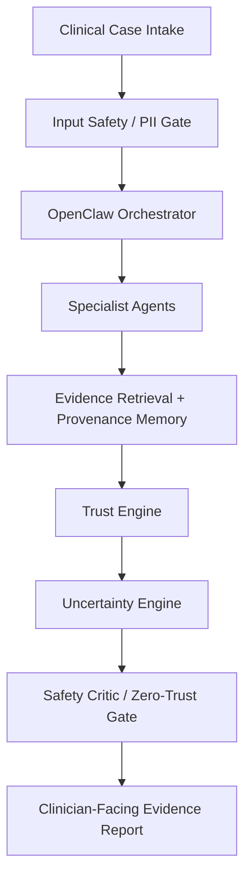

# MedTrust

**A Zero-Trust Multi-Agent Framework with Provenance-Aware Memory and Uncertainty-Guided Retrieval for Clinical Decision Support**

An M.Tech research prototype for clinician-facing clinical decision support. **Phase 1 established the repository and proposed research architecture; Phase 2 adds the FastAPI backend foundation; Phase 3 adds PostgreSQL persistence; Phase 4 adds synthetic clinical-case intake and storage.** No clinical reasoning is implemented and no experimental results are available.

## Research motivation and problem statement

Language models can produce plausible clinical statements without reliable support. Retrieval and collaboration between agents may help, but can also propagate stale evidence, shared errors, poisoned memory, and malicious tool responses. Agreement alone does not establish correctness.

MedTrust will investigate whether explicit evidence provenance, independently assessed trust, uncertainty-guided retrieval, and operation-level authorization improve the reliability and auditability of clinician-facing reports under controlled evaluation.

## Proposed architecture and pipeline



The proposed specialists are History, Lab, Medication, Guideline, Evidence / Research, and Critic agents. Medium uncertainty may trigger bounded additional retrieval and structured analysis; high uncertainty will require human review or additional information. Every recommendation requires clinician review. Tool authorization applies to every tool operation, including operations before the final report gate.

Four distinctions govern the design:

- LLM reasoning != clinical evidence.
- LLM memory != authoritative patient record.
- Agent confidence != agent trust.
- Agent recommendation != permission to act.

Agents will return claims, evidence, citations/provenance, missing information, contradictions, confidence, and limitations. Private chain-of-thought must never be exposed or stored.

## Proposed research contributions

- Provenance-aware longitudinal memory with source lineage, freshness, contradictions, and correction tracking.
- Separate evidence, agent, and memory trust assessments evaluated against independently labeled outcomes.
- Uncertainty-guided retrieval and human escalation with bounded resource use.
- Zero-trust MCP/tool access with least privilege and observable audit trails.
- Controlled adversarial evaluation and ablations that test the incremental value of each component.

These are research objectives, not demonstrated contributions or clinical efficacy claims.

## Safety and ethical scope

Development and evaluation use synthetic data, public datasets, or properly de-identified data only. Public availability does not guarantee de-identification or permission to redistribute; review dataset terms and identifiers before use. Never commit real patient records, identifiers, secrets, or credentials. The input gate is a proposed safeguard, not permission to ingest real patient data.

MedTrust is not an autonomous doctor, diagnostic system, prescribing system, or production medical device. Initial MCP access will be read-only. High-risk or irreversible future actions require explicit human approval and separate authorization; a report cannot authorize execution.

## Technology stack

| Area | Phase 1 / planned direction |
| --- | --- |
| Research development | Python 3.12 and uv; pytest and Ruff tooling |
| Agent orchestration | OpenClaw, proposed; integration deferred |
| Tool interfaces | MCP; authenticated, least-privilege, initially read-only |
| Retrieval and memory | Evidence retrieval and provenance-aware memory; storage and embedding choices deferred |
| Trust and uncertainty | Research components; algorithms deferred |
| Backend and frontend | FastAPI backend foundation; frontend deferred |
| Infrastructure | PostgreSQL 18 for optional local research persistence |

`pyproject.toml` remains a non-distributable research workspace configuration. Backend dependencies and development tools are pinned in `uv.lock`.

## Evaluation strategy

Compare B0 Single LLM through B5 Full MedTrust using fixed cases, independent reference labels, controlled budgets, repeated runs, and component ablations. Measure factual/evidence quality, retrieval performance, calibration, escalation, attack success, and computational cost. Report uncertainty intervals and failures, with no invented results. See [methodology](docs/research-methodology.md), [evaluation plan](docs/evaluation-plan.md), and [threat model](docs/threat-model.md).

## Repository structure

```text
medtrust/
├── README.md
├── LICENSE
├── CONTRIBUTING.md
├── .gitignore
├── .env.example
├── docker-compose.yml
├── pyproject.toml
├── backend/
├── frontend/
├── openclaw/{agents,skills,policies,prompts}/
├── mcp/{fhir_server,evidence_server,medication_server}/
├── rag/{ingestion,embeddings,retrieval,reranking,evaluation}/
├── memory/
├── trust/
├── uncertainty/
├── evaluation/{benchmark,metrics,attacks,experiments}/
├── datasets/synthetic/
├── docs/
│   ├── architecture.md
│   ├── research-methodology.md
│   ├── threat-model.md
│   └── evaluation-plan.md
├── scripts/
└── tests/
```

Empty component directories contain `.gitkeep` placeholders. See [architecture](docs/architecture.md) for responsibilities and [contributing](CONTRIBUTING.md) for workflow.

## Development status

Phase 2 provides FastAPI initialization, routing, typed settings, JSON application logging, safe error handling, a public liveness endpoint, and isolated backend tests. Phase 3 adds SQLAlchemy models, internal Pydantic contracts, lazy sessions, and Alembic migrations. Phase 4 adds six clinical detail entities, nested case creation/retrieval, and 10 fixed synthetic fixtures. Security remains a documented placeholder. RAG, agents, OpenClaw integration, provenance memory, trust and uncertainty engines, MCP servers, frontend, clinical decision logic, and adversarial evaluation remain deferred.

## Local backend development

From the repository root, with Python 3.12 and uv:

```bash
uv sync --locked
uv run pytest
uv run ruff check backend scripts alembic
uv run ruff format --check backend scripts alembic
uv run uvicorn backend.app.main:app --reload --no-access-log
```

App startup, `/health`, and ordinary tests need no Docker, database, model runtime, API key, or actual `.env` file. Case endpoints require a configured, migrated database. Settings optionally load `.env` from the working directory; environment variables take precedence. Supported settings are `MEDTRUST_ENV` (development/test/staging/production), `MEDTRUST_API_HOST` (127.0.0.1), `MEDTRUST_API_PORT` (8000), and `MEDTRUST_LOG_LEVEL` (INFO; uppercase standard levels). `DATABASE_URL` is optional and used only for explicit database operations. Other future service variables in `.env.example` are ignored.

Uvicorn CLI host/port options are separate from application settings. To launch using the configured host and port:

```bash
uv run python -c 'import uvicorn; from backend.app.core.config import get_settings; s = get_settings(); uvicorn.run("backend.app.main:app", host=s.api_host, port=s.api_port, access_log=False)'
```

```bash
curl http://127.0.0.1:8000/health
```

Expected default response:

```json
{"status":"ok","service":"medtrust-api","environment":"development","version":"0.1.0"}
```

Health reports process liveness only. Application logs use JSON and fixed infrastructure events; never pass request contents, credentials, or patient information to logging calls. Server logs are configured separately; the commands disable access logs to avoid recording request URLs. Error responses omit exception details and validation inputs. Authentication is not implemented; run the research API locally on loopback only.

## Local research database (Phase 3)

PostgreSQL persistence is available for `ClinicalCase`, `AgentRun`, `EvidenceRecord`,
and `AuditEvent`. These are research artifacts, not authoritative EHR records.
Phase 4 adds the research case API and fixed dataset below. Agent execution and evidence retrieval remain deferred.

Copy `.env.example` to a local `.env` and replace both database password placeholders
with the same local development password. URL-encode special characters in the URL
password. Never commit `.env`. Compose requires `POSTGRES_PASSWORD`; its port binds
only to loopback. The named volume persists local data. Use synthetic/de-identified
research data only. This Compose configuration is not a production deployment.

From the repository root:

```bash
cp .env.example .env
# Edit .env locally before starting PostgreSQL.
docker compose config --quiet
docker compose up -d postgres
uv run alembic upgrade head
uv run alembic current
uv run alembic check
# Destructive: removes all research tables and their data; disposable databases only.
uv run alembic downgrade base
# Recreate the schema after the downgrade validation.
uv run alembic upgrade head
docker compose stop postgres
```

Validate without Docker or a running database:

```bash
uv sync
uv run pytest
uv run ruff check backend scripts alembic
uv run ruff format --check backend scripts alembic
uv run python -c 'from backend.app.main import app; assert app'
uv run alembic heads
# With DATABASE_URL configured, compile PostgreSQL SQL without connecting:
uv run alembic upgrade head --sql
uv run alembic downgrade 0001:base --sql
```

Tests use in-memory SQLite, including migration upgrade/downgrade and metadata
comparison; this does not establish PostgreSQL runtime compatibility. Validate the
online commands above on a disposable local research database. No database connection
or schema creation occurs at FastAPI startup; `/health` remains liveness-only.
UUIDs and most defaults are assigned at SQLAlchemy insert/flush. UTC timestamps are
stored using PostgreSQL timezone-aware columns. `updated_at` is maintained by
SQLAlchemy updates, not a database trigger. Callers explicitly commit sessions;
uncommitted transactions are rolled back when the dependency closes.

## Synthetic clinical cases (Phase 4)

Only synthetic or explicitly de-identified research data is accepted. Ingestion requires
`source_type` (`synthetic` or `deidentified`) and an explicit `deidentified: true`.
Public benchmark data must already be de-identified and permitted for use. Records
are application-specific research artifacts, not authoritative EHR records.

- `POST /api/v1/cases`: create metadata and optional patient profile, conditions,
  observations, medications, allergies and notes atomically; returns **201**.
- `GET /api/v1/cases/{case_id}`: retrieve the complete structured case by UUID;
  returns **404** if absent. Duplicate external case references return **409**;
  invalid inputs return **422**, without echoing clinical input or SQL details.
- `/docs` and `/openapi.json` document the request and response schemas.
  `/health` remains independent of database availability.

From the repository root, after migration:

```bash
uv run python -m scripts.seed_synthetic_cases --validate-only
uv run python -m scripts.seed_synthetic_cases
# Rerun: inserted 0 / skipped 10; existing cases are never changed.
uv run python -m scripts.seed_synthetic_cases
# Separate live PostgreSQL checks, requiring the local Compose service:
uv run python -m scripts.validate_local_postgres
```

The committed [dataset](datasets/synthetic/clinical_cases.json) contains exactly 10
fixed software research scenarios. Case identifiers `CASE-001`–`CASE-010` and profile
identifiers `SYN-P001`–`SYN-P010` are fictional. Clinical values and supplied event
times are fixed; database UUIDs and ingestion timestamps are assigned on insertion.
The seed command validates the entire dataset before writing, commits the batch
atomically, and skips existing `external_case_id` values. It does not repair or
replace existing records. Downgrading to `0001` drops detail records while preserving
case containers, so perform reversibility checks before seeding; rerunning a seed
after such a downgrade will skip those surviving containers.

To submit one fixture, extract one object from the JSON array and send it as JSON to
`POST /api/v1/cases`; obtain its database UUID from the response for retrieval.
Medication entries are reported history, never prescriptions. Missing values and
conflicting observations are retained without interpretation. There are no reference
answers, generated diagnoses, treatment recommendations, or attack payloads.

Unknown ingestion fields are forbidden at every resource level, including names,
contact details and government identifier fields. Profiles use age, never exact DOB,
and require a synthetic-format identifier. Notes are untrusted input for future
agents; synthetic cases require synthetic notes. A non-synthetic note is eligible
only within an explicitly de-identified case. Free text must be reviewed to exclude
identifiers, secrets and private chain-of-thought; schema validation does not detect
all identifiers embedded in prose.

**This is a research guardrail, not a complete HIPAA/GDPR/DPDP de-identification system.**

## Medical disclaimer

This repository is an unevaluated research prototype, not medical advice. It must not be used to diagnose, prescribe, or make autonomous treatment decisions. Any future evidence report requires review by a qualified clinician. No clinical efficacy, clinical safety validation, or regulatory approval is claimed.
