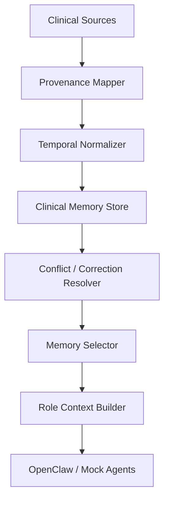
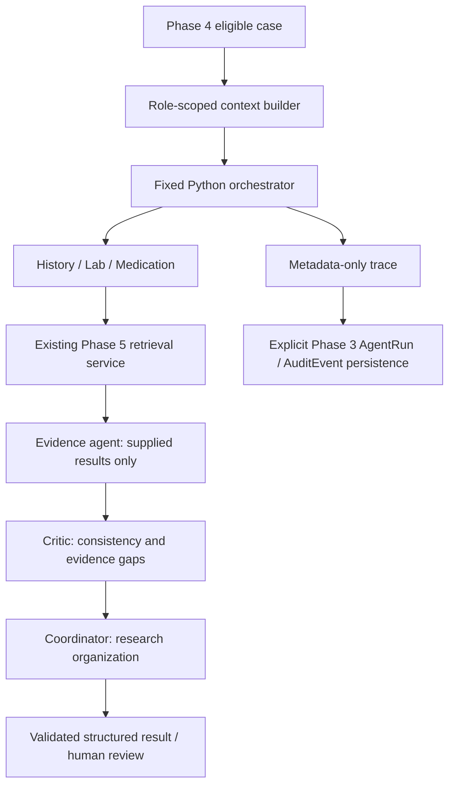

# Proposed research architecture

The clinical pipeline below remains proposed. Phase 1 established documentation and scaffolding; Phase 2 added the FastAPI foundation; Phase 3 added persistence; Phase 4 adds synthetic case intake and clinical research details.

## Governing distinctions

- **LLM reasoning != clinical evidence:** generated analysis cannot serve as its own supporting source.
- **LLM memory != authoritative patient record:** memory is a derived, fallible research representation; source records remain distinct.
- **Agent confidence != trust:** self-reported confidence is an output to calibrate, not an authorization signal or independent reliability estimate.
- **Agent recommendation != authorization:** only an independently enforced operation policy can permit a tool action.

No private chain-of-thought will be requested for storage, exposed, or logged. Observable artifacts are structured findings, short evidence-grounded summaries, and policy decision reasons.

## Pipeline and boundaries

Clinical Case Intake → Input Safety / PII Gate → OpenClaw Orchestrator → Specialist Agents → Evidence Retrieval + Provenance-Aware Memory → Trust Engine → Uncertainty Engine → Safety Critic / Zero-Trust Gate → Clinician-Facing Evidence Report.

This is the conceptual reporting sequence. Retrieval may recur under a bounded uncertainty policy. The tool gateway mediates every call throughout the sequence, not just at the final gate. Inputs, retrieved documents, memory, agent messages, and tool responses cross separate trust boundaries and never carry implicit authority.

## Clinical Case Intake

Accept only synthetic, public appropriately de-identified, or properly de-identified research cases. Preserve a case identifier, source reference, event times, units, and missing fields without filling gaps with invented facts. Separate reported history from verified observations. Intake is not diagnosis or an authoritative record editor.

## Input Safety / PII Gate

Check data eligibility, identifiers, malformed content, and untrusted embedded instructions before agent processing. Reject or quarantine disallowed inputs; minimize retained data and redact audit metadata. Treat clinical narrative as data, never as system instructions. Detection is imperfect and complements dataset governance rather than replacing it.

## OpenClaw Orchestrator

The future orchestrator will coordinate specialist assignments, bounded retries, retrieval budgets, and report assembly. It will propagate scoped identity and case context and enforce structured output contracts. It must not promote agent consensus into evidence or confer tool privileges through task delegation. Integration details remain undecided.

## Specialist agents

| Agent | Intended responsibility |
| --- | --- |
| History Agent | Organize reported history, temporal relationships, missing information, and contradictions |
| Lab Agent | Summarize supplied laboratory observations with units, source references, and contextual limitations |
| Medication Agent | Reconcile supplied medication information, timestamps, and inconsistencies; no prescribing or execution |
| Guideline Agent | Retrieve applicable guideline passages, versions, and applicability limitations |
| Evidence / Research Agent | Retrieve and compare supporting and conflicting research evidence |
| Critic Agent | Challenge unsupported claims, source mismatches, contradictions, and unsafe report content |

Each output will contain claims, evidence, citations/provenance, missing information, contradictions, confidence, and limitations. A concise evidence-grounded finding is sufficient; internal reasoning traces are excluded. The Critic Agent provides analysis; it cannot replace the independent policy enforcement gateway.

## Evidence retrieval

Phase 5 ingestion, embeddings, retrieval, and reranking retain source identifiers, publication/version dates, retrieval times, passages, and applicability metadata. Retrieval will seek disconfirming as well as supporting evidence. Source quality, freshness, and entailment must be assessed separately from retrieval rank. A high similarity score is not evidence correctness. Untrusted document instructions must not affect policies or tool authority.

## Provenance-aware memory

Phase 7 implements the research memory boundary documented in
[provenance-memory.md](provenance-memory.md). Explicit ClinicalMemoryScope membership
links episodes; case-local synthetic profile labels never establish identity.



Host-created source snapshots and generated assertions remain distinct. Generated
assertions are not clinical ground truth. Memory is optional in Phase 6 orchestration;
OpenClaw native memory remains disabled. Confidence components are explicit research
heuristics, separate from future agent trust and uncertainty. The following research
objectives include future source-versioning, retention, and policy work.

Longitudinal memory will preserve the lineage of each derived finding: research case ID, source reference and version, event time, ingestion time, producing agent/version, evidence links, and supersession/correction relationships. Derived claims must remain distinguishable from source observations. Conflicting entries will be retained with explicit conflict status instead of silently overwritten. Stale or unverifiable entries should be excluded from reliance or flagged for review. Retention, access, and deletion policies will apply to memory and audit records alike.

## Trust engine

Assess three separate concepts: evidence trust (quality, freshness, provenance and applicability), agent trust (independently measured reliability and policy compliance), and memory trust (lineage integrity, corroboration and freshness). Do not infer reliability from confidence, fluency, consensus, or repeated copies of the same source. Track dependent evidence to avoid double counting. Trust estimates need uncertainty and calibration against held-out labels; formulas, aggregation, and thresholds are future research decisions.

## Uncertainty engine

Estimate uncertainty from missing information, contradictions, evidence insufficiency, disagreement, and calibration signals. Thresholds will be selected on development data and frozen before held-out evaluation.

| Level | Intended behavior |
| --- | --- |
| LOW | Proceed to clinician-facing evidence report, with limitations and mandatory clinician review |
| MEDIUM | Retrieve more evidence and/or perform additional structured reasoning within a fixed budget |
| HIGH | Escalate to human review / request additional information; withhold unsupported conclusions |

When additional retrieval fails or budgets are exhausted, report unresolved uncertainty and escalate. Low uncertainty never bypasses authorization or implies clinical correctness.

## Safety critic and clinician report

The final safety review will check evidence support, contradictory findings, unsupported claims, missing context, and policy compliance. The report will show structured findings, traceable evidence, uncertainty, limitations, and escalation status. Recommendations require clinician review. Reports are informational artifacts and confer no permission to act.

## Zero-trust tool gateway

Future MCP access is authenticated, least-privilege, deny-by-default, and initially read-only. Authenticate agents and tools, authorize each operation against identity, resource, sensitivity, and uncertainty, validate arguments, and treat responses as untrusted data. Gateway outcomes are ALLOW, ALLOW_AND_AUDIT, REQUIRE_HUMAN_APPROVAL, or DENY. Every privileged operation is audited, including ALLOW; ALLOW_AND_AUDIT requests enhanced review metadata. Approval does not override a denied capability. No write or execution capability exists in this phase; future irreversible/high-risk capabilities require explicit human approval tied to the precise operation and separate policy authorization.

## Audit and evaluation pipeline

Record research case/run IDs, component and policy versions, source references, structured outputs, gateway outcomes, escalation events, and timing/cost metadata. Exclude secrets, real patient information, and private chain-of-thought. Keep audit access scoped and make integrity changes detectable. Evaluation will replay frozen cases and local adversarial scenarios, associate outputs with independent labels, and report component failures as well as aggregate scores. Phase 3 supplies audit record storage; integrity enforcement mechanisms remain deferred.

## Phase 3 persistence foundation

SQLAlchemy 2.x typed models share declarative metadata with a reversible Alembic
migration. PostgreSQL with synchronous psycopg 3 is the local persistence target;
SQLite supports isolated model and migration tests. Settings supply `DATABASE_URL`,
kept out of settings representations. Engine creation is lazy and SQL parameter
logging is disabled. App import, startup and `/health` do not connect to a database.

- **ClinicalCase** stores a unique research case reference, title, summary, eligible
  source type, de-identification flag and timestamps. Only synthetic/de-identified
  source values and a true de-identification flag are accepted. These declarations
  do not prove that free text is de-identified; eligibility review remains required.
- **AgentRun** links to one case and records observable execution metadata and concise
  output summaries. Pending runs have nullable `started_at`; completion time is also
  nullable. No execution, state machine or hidden chain-of-thought storage exists.
- **EvidenceRecord** stores source references, publication/retrieval dates, a caller
  supplied content hash (use an algorithm-prefixed value such as `sha256:...`) and
  provenance JSON. A nullable case link permits shared source metadata. This persistence model does not ingest documents or compute hashes; Phase 5 does
  so independently in rag/. No provenance/trust scoring is implemented.
- **AuditEvent** records actor/action/outcome and optional case/run/resource references.
  Nullable links support system-level events. When both case and run are supplied,
  callers must keep their case association consistent; cross-link enforcement is deferred.

Cases have many runs, evidence records and audit events; runs have many audit events.
Foreign keys use RESTRICT, with no cascading deletes or automatic reference nulling,
so parent deletion cannot silently erase or detach history. Audit rows have only a
creation timestamp and no update schema: append-only use is a convention at this
stage, not database-enforced immutability. Controlled retention/deletion policies and
append-only database permissions are future work. JSON changes should replace the
whole value; in-place nested mutation tracking is not configured.

All four entities are research artifacts, **not authoritative EHR records**. No direct
PII columns are present; schema tests guard against obvious identifiers. Free-text
and JSON fields are not PII detectors. `AuditEvent.details` must contain safe structured
metadata only: no secrets, API keys, OAuth tokens, full prompts containing sensitive
records, sensitive patient data or hidden chain-of-thought. The same restrictions
apply to summaries, references, error messages and provenance metadata. Never log
records, connection URLs or database exception details. Phase 3 records retain their internal contracts. Phase 4 exposes only case intake and
retrieval; external clinical connections and later-phase functionality remain deferred.


## Phase 4 clinical research artifacts

"FHIR-inspired" means MedTrust borrows familiar clinical resource concepts and terminology while keeping the research schema intentionally simplified and application-specific.
This is not FHIR compliance, a FHIR server, or a production EHR integration. No FHIR
SDK or terminology service is required. The future MCP FHIR/mock server is deferred.

`ClinicalCase` remains the top-level research container. Its optional detail records
are **not authoritative EHR records**. Future evidence and agent layers will operate
over these research artifacts without treating their contents as instructions or
verified clinical truth.

| Entity | Contents and relationship to ClinicalCase |
| --- | --- |
| PatientProfile | Zero or one; synthetic identifier, optional age, recorded sex, pregnancy/smoking context, height and weight; no DOB or identity/contact fields |
| Condition | Many; supplied condition name/code, status, onset description and notes |
| Observation | Many; supplied numeric/text measurement, units, optional range, supplied interpretation and collection time |
| Medication | Many; reported name/code, dose, units, route, frequency, status and dates; no prescribing logic |
| Allergy | Many; supplied substance, reaction, optional severity, status and recording time |
| ClinicalNote | Many; type, title, untrusted narrative, authorship time and synthetic flag (defaults true) |

All details have UUIDs, case foreign keys and creation timestamps. Profiles also have
an update timestamp and a unique case foreign key. Other case foreign keys are indexed.
Synthetic profile identifiers are case-local labels, not longitudinal patient identity;
the seed dataset additionally requires uniqueness across its 10 cases. There are no
cross-field clinical inferences (for example, pregnancy is not inferred from recorded sex).

Relationships explicitly cascade only `save-update, merge`. Every foreign key uses
`RESTRICT`, and `passive_deletes="all"` prevents ORM nulling even for loaded details.
There is no delete/delete-orphan cascade. Case deletion requires explicit dependent
record handling and cannot silently erase clinical details, audit, evidence or run
history. Phase 3 audit/evidence relationships and migration `0001` are unchanged.
Migration `0002` creates six tables and their constraints/indexes; its downgrade
removes only these detail tables. It preserves Phase 3 containers and history, but
cannot preserve the dropped clinical details. No deletion endpoint is provided.

Input schemas forbid extra fields and constrain demographic/status values, finite
numeric values, ordered reference ranges and medication dates. Observations require
at least one numeric/text value; numeric values require an explicit unit (`1` for
dimensionless values). Both supplied value forms may coexist. Blood pressure is
represented as separate named systolic/diastolic observations with explicit units.
Ranges and interpretation labels are supplied data, never calculated diagnoses.
Timestamps must include a timezone. Notes and other narrative fields must contain
only eligible synthetic/de-identified text and no private chain-of-thought.

The service flushes nested records inside a savepoint; callers commit or roll back
the outer transaction. Unique database constraints handle duplicate races, while
unrelated integrity failures use the existing safe error handler. Detail retrieval
uses six `selectinload` relationships (bounded query count, no per-child queries).
The API serializes no run/audit/evidence internals. Collection ordering is stable
by ingestion timestamp and UUID, not a clinical chronology or input-order promise.

The fixed dataset covers blood pressure and glucose monitoring, a hemoglobin pattern,
renal measurements, reported allergy, respiratory/fever symptoms, conflicting
medication history, missing labs, and conflicting observations. These are software
fixtures, without adjudicated diagnoses, benchmark labels or treatment guidance.
Ordinary tests use temporary SQLite databases with foreign keys and transactional
savepoints enabled. The separate `scripts.validate_local_postgres` command checks
base/head migrations, downgrade/re-upgrade, nested round trips and seed reruns in a
transaction-isolated temporary PostgreSQL schema, then rolls everything back.
It verifies the database matches the loopback MedTrust Compose development service.

The ingestion declaration and unknown-field rejection do not prove that prose is
free of identifiers. Dataset eligibility and narrative review remain required.
**This is a research guardrail, not a complete HIPAA/GDPR/DPDP de-identification system.**

## Phase 5 evidence retrieval foundation

Implemented independently of case intake and FastAPI startup:

```text
Reviewed local evidence JSON -> validation + canonical SHA-256 -> word chunks
  -> local normalized sentence-transformer embeddings -> Qdrant cosine search
  -> local BM25 lexical index                         -> lexical search
                          -> reciprocal rank fusion -> optional lexical reranking
                          -> ranked structured evidence with complete provenance
```

Provenance fields (including arbitrary reviewed metadata, nullable dates,
jurisdiction and document version) travel inside each chunk payload and result.
The SHA-256 content hash covers NFC-normalized, whitespace-collapsed UTF-8 content;
chunk IDs additionally include document/version and window configuration. A corpus
fingerprint covers every chunk and its metadata, scopes Qdrant search and checks
that the dense and sparse corpus match. Hashes are not source authentication.
**Retrieval relevance != clinical validity.** No trust/uncertainty scores or clinical
memory are computed. The Phase 3 EvidenceRecord remains an independent audit-oriented
model; the retrieval index lives only in Qdrant. No agents, MCP or diagnosis API
are introduced. The optional search endpoint is omitted to avoid coupling the app
to model downloads and Qdrant availability.

BM25 uses lowercase alphanumeric tokens, k1=1.5 and b=0.75 over title plus chunk text.
Dense embedding uses chunk text. Fusion sums 1/(60 + one-based rank), with configurable
constant, unique chunk IDs and deterministic ID ties. Default candidate limit is 100
per branch. The optional reranker adds 0.10 times query-term title coverage and 0.05
times query-term text coverage to the fusion score. These are transparent relevance
heuristics, not clinical confidence. Non-reranked results have rerank_score=0.

## Implemented Phase 6 boundary

The preceding full research pipeline remains proposed. Phase 6 implements only:



Each agent call crosses the `AgentRuntime` boundary into a deterministic mock or
OpenClaw `agent exec` adapter. Schema and invocation identity checks precede acceptance;
citation fields must match supplied retrieval provenance. No agent chooses subsequent
roles or grants tools. Any runtime, validation or retrieval failure terminates the run.
The coordinator is invoked last and cannot repair, bypass or continue failed stages.

History receives summary, conditions and notes; lab receives observations; medication
receives medications and allergies. Patient profile identifiers, database timestamps
and unrelated detail groups are omitted. Evidence receives explicit questions and
complete Phase 5 retrieval results (including provenance, source text, ranks/scores).
Critic and coordinator receive structured summaries, missing information, consistency
findings and citations, excluding raw fact payloads and runtime metadata. All such
content remains untrusted. No automatic loading of prior sessions or memory occurs.

There are six agent invocations, at most nine deduplicated questions, five results per
question, and zero retries. The default local runner explicitly uses sparse retrieval;
hybrid/dense are explicit selections that preserve Phase 5 failure semantics.

OpenClaw runs with a temporary pinned config, named identity, external workspace,
resolved model, native harness, no tools/skills/plugins, and disabled memory/context
loading. Import/startup remains CLI-independent. This is a local execution boundary,
not the later zero-trust MCP gateway. Details and compatibility limits are in
[openclaw/README.md](../openclaw/README.md).

Trace metadata includes state transitions, invocation IDs, input hashes/byte counts,
result counts, retrieval question hashes, timing and safe error categories. Existing
JSON logging emits fixed observable events. Optional explicit persistence reuses
AgentRun/AuditEvent without a migration; the caller owns its transaction. Traces are
in-memory until persisted and are not crash-durable or tamper-evident. Generated prose
is excluded from database audit records. The optional HTTP endpoint is omitted to
keep live execution out of the unauthenticated Phase 4 API.
